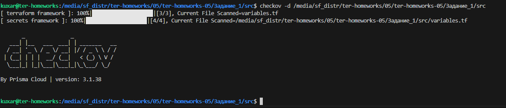

Задание 1.

    1. demonstration1 Проверка кода с помощью checkov

       demonstration1 Проверка кода с помощью tflint

    2. src Проверка кода с помощью checkov

       src Проверка кода с помощью tflint

    Коммит к заданию 1.

https://github.com/NeTrogajSvetchu/ter-homeworks-05/commit/cb8274feb82114928267fc5b1bff071347e8e365

Задание 2.

    1. Создал бакет

    2. Создал сервисный аккаунт и предоставил права на бакет

    3. Произвел миграцию проекта в s3

    4. принудительно разблокировал стейт

Коммит к заданию 2.

https://github.com/NeTrogajSvetchu/ter-homeworks-05/commit/e1d50b8609d811ebaf0436a87eadce5523105624

Задание 3.

    1. Исправил ошибки и залил в git

https://github.com/NeTrogajSvetchu/ter-homeworks-04/tree/terraform-hotfix

    2. PR

https://github.com/NeTrogajSvetchu/ter-homeworks-04/pull/1

Коммит к заданию 3.

https://github.com/NeTrogajSvetchu/ter-homeworks-05/commit/9d34e00eeafe6fb402fc40e1f714af089021bcbd

Задание 4.

    1. Корректные IP в переменных

    2. Не корректные IP в переменных
   

    3. Сами переменные спер у "https://gist.github.com/guillermo-musumeci"

variable "ip" {
  type = string
  description = "ip-адрес"
  default = "192.168.0.1"
    validation {
      
      condition = can(regex("^(25[0-5]|2[0-4][0-9]|[01]?[0-9][0-9]?)\\.(25[0-5]|2[0-4][0-9]|[01]?[0-9][0-9]?)\\.(25[0-5]|2[0-4][0-9]|[01]?[0-9][0-9]?)\\.(25[0-5]|2[0-4][0-9]|[01]?[0-9][0-9]?)$",var.ip))
      error_message = "Некорректный IP"
    }
}
variable "ip1" {
  type = list(string)
  description = "ip-адрес"
  default = ["192.168.0.1", "1.1.1.1", "127.0.0.1"]
    validation {
      
      condition = alltrue([for ip in var.ip1: can(regex("^(25[0-5]|2[0-4][0-9]|[01]?[0-9][0-9]?)\\.(25[0-5]|2[0-4][0-9]|[01]?[0-9][0-9]?)\\.(25[0-5]|2[0-4][0-9]|[01]?[0-9][0-9]?)\\.(25[0-5]|2[0-4][0-9]|[01]?[0-9][0-9]?)$", ip))])
      error_message = "Некорректный IP"
    }
}

Коммит к заданию 4.

https://github.com/NeTrogajSvetchu/ter-homeworks-05/commit/468a2f3342afe20a5fa118c698a9303018baa764

Задание 5.

    1. Вывод ошибки 
   

    2. Переменные

variable "in_the_end_there_can_be_only_one" {
    description="Who is better Connor or Duncan?"
    type = object({
        Dunkan = optional(bool)
        Connor = optional(bool)
    })

    default = {
        Dunkan = true //false
        Connor = false
    }

    validation {
        error_message = "There can be only one MacLeod"
        condition = var.in_the_end_there_can_be_only_one.Dunkan != var.in_the_end_there_can_be_only_one.Connor
    }
}

variable "in" {
    description="321?"
    type = string
    default = "ffff"

    validation {
        error_message = "123"
        condition = can(regex("^[[:lower:]]+$",var.in))
    }
}

Коммит к заданию 5.

https://github.com/NeTrogajSvetchu/ter-homeworks-05/commit/5b5e824d0c25603608f631c57da362ef9d8638a2

Задание 6.

    Вернусь как изучу CI/CD-систему

Задание 7.

    1. Создал три модуля 

    2. Объединил их общим main.tf

    3. Перенес в основной main.tf

Коммит к заданию 7.

https://github.com/NeTrogajSvetchu/ter-homeworks-05/commit/af5ac6e2b59778c6fce76e2f9a7698b82acbf98c